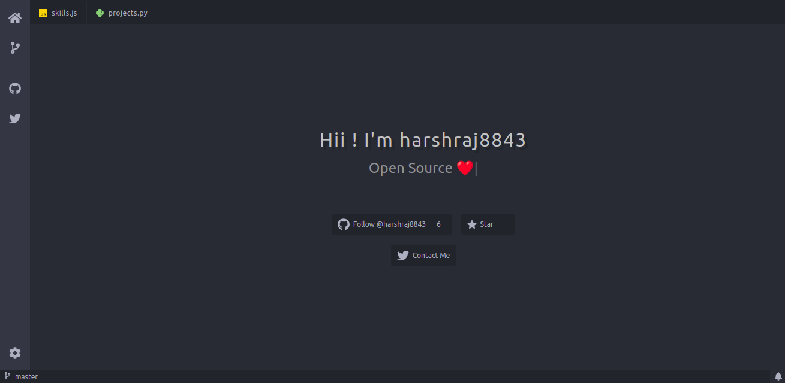

<h3 align="center">Dev Web React</h3>

---

<div align="center">

[](https://raj-harsh.web.app/)

[](https://github.com/harshraj8843/devweb-react/blob/master/LICENSE.md)  [](https://github.com/harshraj8843/devweb-react/graphs/contributors) [](https://github.com/harshraj8843/devweb-react/graphs/commit-activity)

</div>

---

## 📝 Table of Contents

- [About](#about)
- [Getting Started](#getting_started)
- [Built Using](#built_using)

## 🧐 About <a name = "about"></a>

A VS Code themed Web App.

<p align="center">
 
</p>

## 🏁 Getting Started <a name = "getting_started"></a>

- clone project
  ```
  git clone https://github.com/harshraj8843/devweb-react
  ```
  ```
  cd devweb-react/
  ```
- Install packages
  ```
  yarn
  ```
- Config `.env`
  - Rename `.env.example` to `.env`
  - Add Personal Access Token to `.env`
    ```
    REACT_APP_GITHUB_TOKEN = <github_token_here>
    ```
- Start development server
  ```
  yarn start
  ```

## ⛏️ Built Using <a name = "built_using"></a>

- [React Js](https://reactjs.org/)
- [Typed Js](https://mattboldt.com/demos/typed-js/)
- [github-readme-stats](https://github.com/anuraghazra/github-readme-stats)
- [shiels.io](https://github.com/badges/shields)
